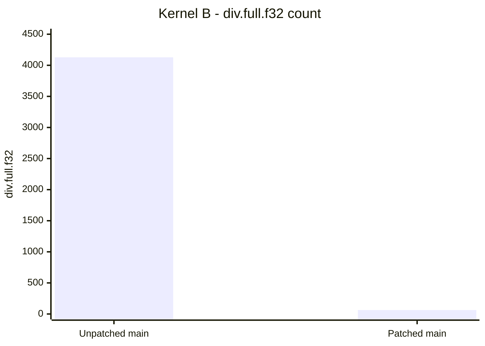
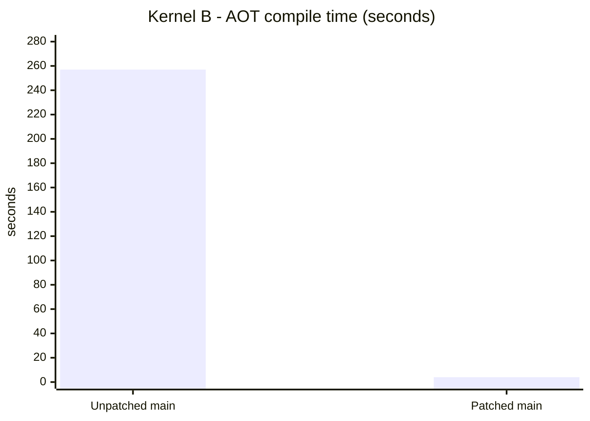
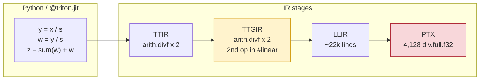
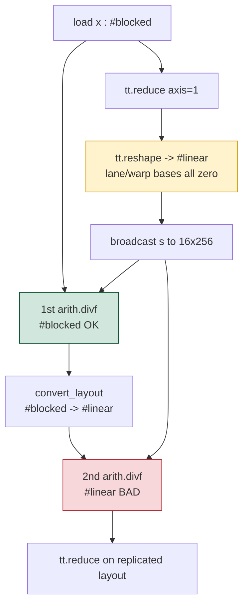
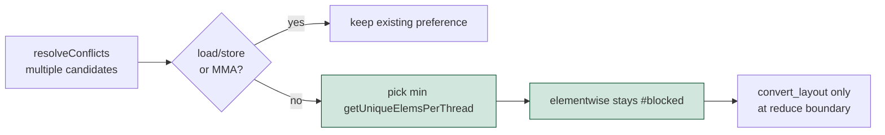
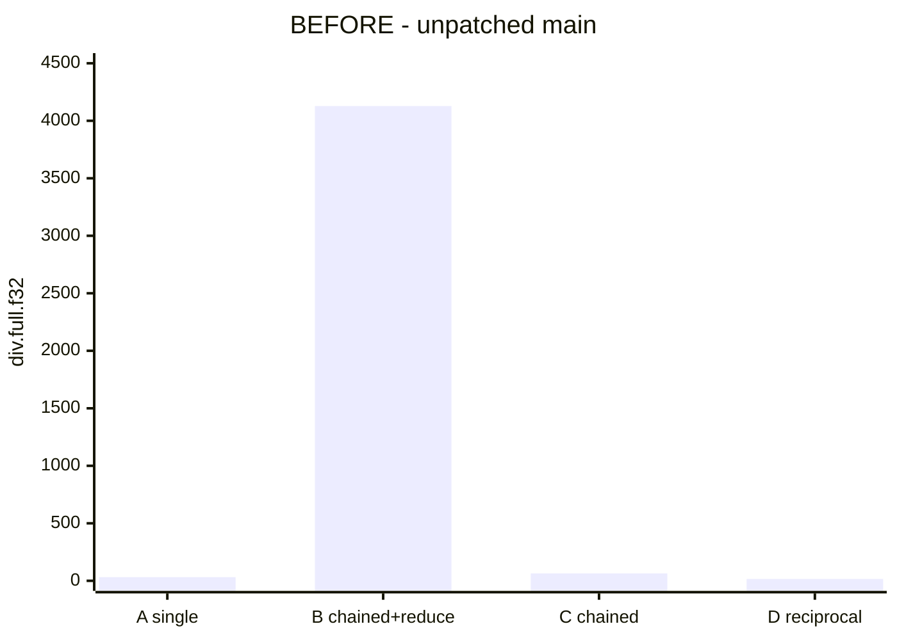
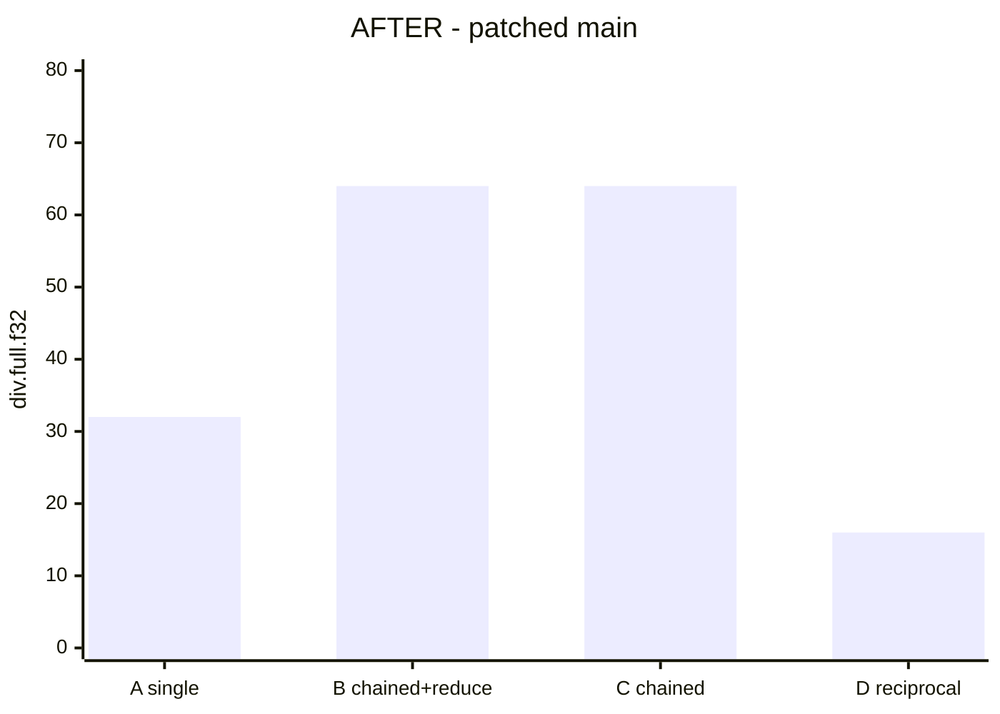

# Triton #10987 - Replicated Layout Blowup: Root Cause, Fix, and Validation

[](https://github.com/triton-lang/triton/issues/10987)
[](./VALIDATED.md)
[](./VALIDATED.md)
[](https://github.com/triton-lang/triton)
[](https://developer.nvidia.com/cuda-toolkit)
[](./10987-fix-final.patch)

Research and engineering kit for **[triton-lang/triton#10987](https://github.com/triton-lang/triton/issues/10987)**: a chained `fp32` division-by-broadcast that feeds a reduction was emitting **4,128 `div.full.f32`** instructions and taking minutes to compile. This repository documents the root cause, ships a minimal compiler patch, and records a **before/after benchmark from a real GPU build**.

---

## Headline results

Measured on **vast.ai RTX 5090**, Triton **main 3.8.0** (`7842017`), AOT target `GPUTarget("cuda", 90, 32)`, tile `[16, 256]`, `num_warps=4`.

| Metric (kernel **B**) | Unpatched main | After fix | Change |
|---|---:|---:|---:|
| `div.full.f32` | **4,128** | **64** | **64x fewer** |
| AOT compile time | **257.0 s** | **4.1 s** | **~63x faster** |
| PTX lines | **19,101** | **6,645** | **~2.9x smaller** |

Kernels **A / C / D** are unchanged (no regressions).





---

## The bug in one picture

Kernel **A** (one div, then reduce) is fine. Kernel **B** adds a second chained division before the reduce and explodes at LLVM/PTX lowering - not in the Triton IR division count.



| Stage | Approx. lines | `arith.divf` | `div.full.f32` |
|---|---:|---:|---:|
| TTIR | ~86 | **2** | 0 |
| TTGIR | ~88 | **2** | 0 |
| LLIR | ~22,400 | 0 | 0 |
| PTX (unpatched B) | **19,101** | 0 | **4,128** |

The IR still shows two divisions; the blowup is **layout materialization** in `ConvertTritonGPUToLLVM`.

---

## Root cause

In `RemoveLayoutConversions`, `LayoutPropagation::resolveConflicts` preferred a *blocked* layout for loads/stores, but for other ops (e.g. `arith.divf`) it kept the **arbitrary first candidate**. That candidate could be a replicated `#linear` layout (all lane/warp bases `[0,0]`), so every thread materializes the full tile.



**Why the workarounds match the theory**

| Kernel | Pattern | `div.full.f32` | Why |
|---|---|---:|---|
| **A** | single div then reduce | 32 | no second div |
| **B** | chained div then reduce | **4,128** | 32 blocked + 4,096 replicated |
| **C** | chained div, no reduce | 64 | nothing forces `#linear` |
| **D** | reciprocal then mul | 16 | div on tiny `[16,1]` tensor |

Consistency check: `4128 = 32 + 4096`.

---

## The fix

**File:** `lib/Dialect/TritonGPU/Transforms/RemoveLayoutConversions.cpp`

**Change:** when no load/store/MMA preference applies, break the tie toward the candidate with the **fewest elements per thread** (`getUniqueElemsPerThread`) - the most distributed layout.



**After the fix (TTGIR excerpt)**

```mlir
%y_10 = arith.divf %x_7, %y_9 : tensor<16x256xf32, #blocked>
%w    = arith.divf %y_10, %y_9 : tensor<16x256xf32, #blocked>
%w_11 = ttg.convert_layout %w
      : tensor<16x256xf32, #blocked> -> tensor<16x256xf32, #linear>
```

Both divisions stay `#blocked`. Conversion to `#linear` happens only for the trailing reduce.

Deliverable patch (fix + lit test): [`10987-fix-final.patch`](./10987-fix-final.patch)

---

## Full A/B/C/D comparison

### `div.full.f32` by kernel





| Kernel | Unpatched | Patched | Verdict |
|---|---:|---:|---|
| A - single div then reduce | 32 | 32 | unchanged |
| **B - chained div then reduce** | **4,128** | **64** | **fixed** |
| C - chained, no reduce | 64 | 64 | unchanged |
| D - reciprocal | 16 | 16 | unchanged |

### Compile latency (kernel B)

| AOT target | Unpatched | Patched |
|---|---:|---:|
| `cuda:90` | 257.0 s | **4.1 s** |
| `cuda:75` | 187.0 s | **4.0 s** |

---

## Regression suite

| Test | Result |
|---|---|
| `test/TritonGPU/combine.mlir` | PASS |
| `remove-layout-conversions-disable-remat.mlir` | PASS |
| `remove-layout-conversions-backward-remat-reuse.mlir` | PASS |
| `remove-layout-conversions-scf-cleanup.mlir` | PASS |
| **`remove-layout-conversions-10987.mlir`** (new) | PASS |

**5/5 passing** on the patched `triton-opt`. The PTX gate `test_10987_div_blowup.py` also runs under pytest and passes with `B < 128` `div.full.f32`.

Details: [`VALIDATED.md`](./VALIDATED.md) | analysis: [`ROOT_CAUSE.md`](./ROOT_CAUSE.md) | build steps: [`FIX_PLAYBOOK.md`](./FIX_PLAYBOOK.md)

---

## Repository layout

```text
.
|-- 10987-fix-final.patch      # PR-ready: C++ fix + lit test (git am)
|-- 10987-fix.patch             # earlier variant
|-- test_10987_div_blowup.py    # PASS if B < 128 div.full.f32
|-- triton_aot_repro.py         # A/B/C/D PTX table
|-- dump_ttgir.py               # inspect #blocked vs #linear on divf
|-- build_and_test_4090.sh      # one-shot build + verify on a GPU box
|-- ROOT_CAUSE.md               # IR bisect + layout theory
|-- VALIDATED.md                # measured before/after
|-- FIX_PLAYBOOK.md             # end-to-end PR playbook
|-- CLAIM_COMMENT.md            # draft issue comment
|-- project-walkthrough.html    # HTML walkthrough
|-- _kernel_B.py                # kernel B snippet
`-- README.md
```

---

## Quick start

### Reproduce the bug (AOT; no GPU kernel launch required)

```bash
pip install triton   # or build from source
python test_10987_div_blowup.py
python triton_aot_repro.py
```

Expect kernel **B = 4128** on unpatched Triton (threshold in the test is `< 128` for a pass).

### Apply and verify the fix (Linux + NVIDIA GPU)

```bash
sed -i 's/\r$//' build_and_test_4090.sh   # if copied from Windows
bash build_and_test_4090.sh ~/triton ./10987-fix-final.patch
```

**PASS criterion:** `B_chained_div_reduce : div.full.f32 < 128` (measured **64** after the fix).

### Inspect layouts

```bash
export PYTHONPATH=/path/to/triton/python   # needed when the PyTorch-pinned system triton wheel shadows the editable build
python dump_ttgir.py | grep -nE 'divf|#linear|#blocked'
```

---

## Validation environment

| | |
|---|---|
| Host | vast.ai container |
| Physical GPU | NVIDIA GeForce **RTX 5090** (32 GB, driver reports compute capability **12.0**) |
| AOT compile target | `GPUTarget("cuda", 90, 32)` / `cuda:75` (codegen paths exercised offline) |
| CUDA toolkit | **13.0** |
| Triton | **main 3.8.0** @ `7842017`, then patched |
| Python | 3.12 |

> Note: the physical GPU is Blackwell (CC 12.0). The regression harness compiles ahead-of-time for `cuda:90` / `cuda:75` so PTX instruction counts are comparable to the issue report (H100 / sm_90).

---

## Upstream

- **PR: [triton-lang/triton#11117](https://github.com/triton-lang/triton/pull/11117) — open, review requested**
- Issue: [triton-lang/triton#10987](https://github.com/triton-lang/triton/issues/10987)
- Related draft (independent approach): [triton-lang/triton#11048](https://github.com/triton-lang/triton/pull/11048)

To open a PR from a proper fork of `triton-lang/triton`:

```bash
git clone https://github.com/<you>/triton.git && cd triton
git checkout -b fix/10987-elementwise-replicated-layout
git am /path/to/10987-fix-final.patch
git push -u origin HEAD
```

---

## License and attribution

The patch targets [triton-lang/triton](https://github.com/triton-lang/triton) (upstream license applies to Triton itself). Analysis, repro scripts, and documentation in this repository are provided to support diagnosing and fixing #10987.

**Author:** [ArchanaChetan07](https://github.com/ArchanaChetan07)
