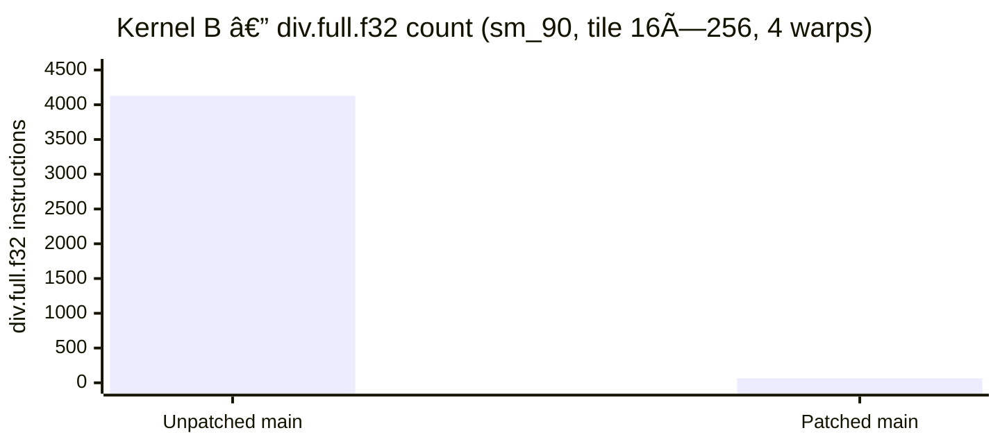
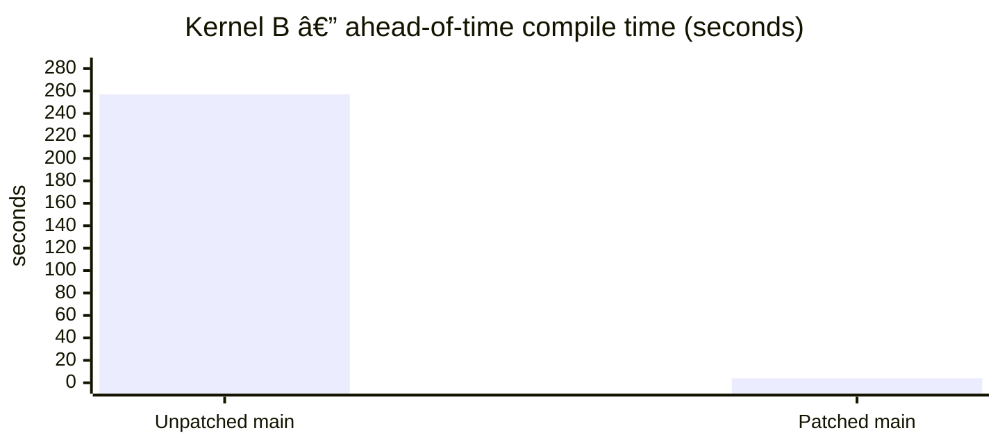
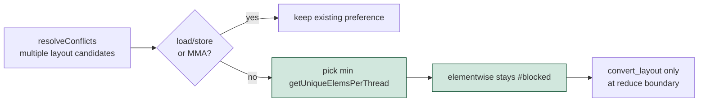
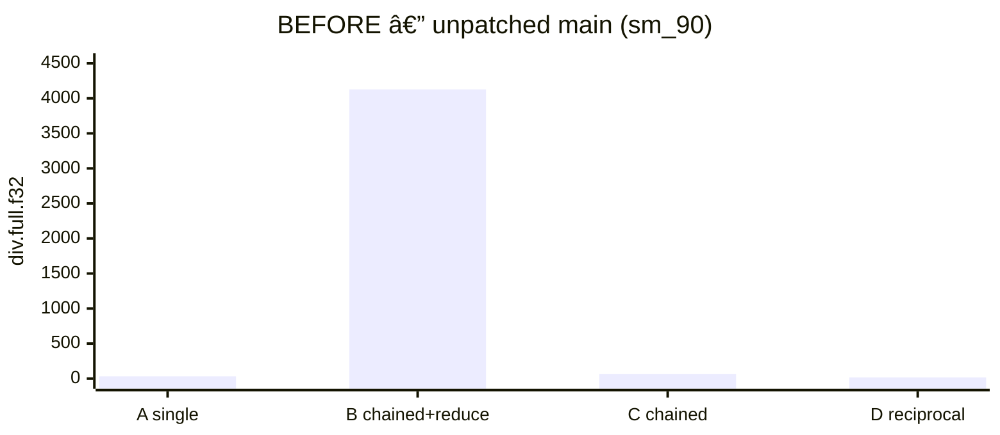
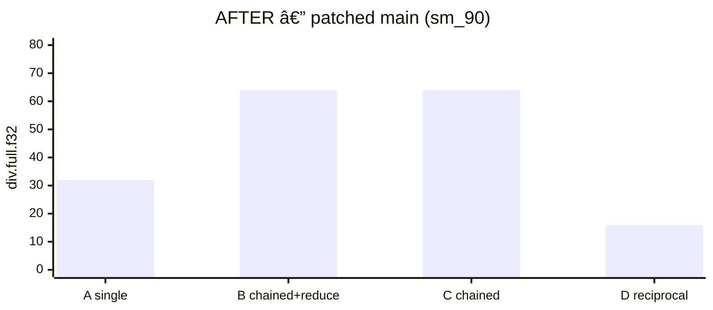

# Triton #10987 — Replicated Layout Blowup: Root Cause, Fix & Validation

[](https://github.com/triton-lang/triton/issues/10987)
[](./VALIDATED.md)
[](./VALIDATED.md)
[](https://github.com/triton-lang/triton)
[](https://developer.nvidia.com/cuda-toolkit)
[](./10987-fix-final.patch)

Research and engineering kit for **[triton-lang/triton#10987](https://github.com/triton-lang/triton/issues/10987)**: a chained `fp32` division-by-broadcast that feeds a reduction was emitting **~4,128 `div.full.f32`** instructions and taking minutes in `ptxas`. This repository documents the root cause, ships a minimal compiler patch, and records **before/after numbers from a real GPU build**.

---

## Headline results

| Metric (kernel **B**) | Unpatched `main` | After fix | Δ |
|---|---:|---:|---:|
| `div.full.f32` | **4,128** | **64** | **64× fewer** |
| AOT compile time (sm_90) | **257 s** | **4.1 s** | **~63× faster** |
| PTX lines | ~19,100 | ~6,600 | ~3× smaller |

Kernels **A / C / D** are unchanged (no regressions).





---

## The bug in one picture

A near-identical kernel (**A**: one div → reduce) is fine. Kernel **B** adds a second chained division before the reduce and explodes at LLVM/PTX lowering — not in the Triton IR count of divisions.

```mermaid
flowchart LR
    subgraph Source["Python / @triton.jit"]
        S["y = x / s<br/>w = y / s<br/>z = sum(w) + w"]
    end

    subgraph IR["IR stages"]
        TTIR["TTIR<br/>arith.divf × 2"]
        TTGIR["TTGIR<br/>arith.divf × 2<br/>but 2nd in #linear"]
        LLIR["LLIR<br/>~22k lines"]
        PTX["PTX<br/>4,128 × div.full.f32"]
    end

    S --> TTIR --> TTGIR --> LLIR --> PTX

    style TTGIR fill:#fff3cd,stroke:#d4a017
    style PTX fill:#f8d7da,stroke:#b02a37
```



| Stage | Lines | `arith.divf` | `div.full.f32` |
|---|---:|---:|---:|
| TTIR | ~86 | **2** | 0 |
| TTGIR | ~88 | **2** | 0 |
| LLIR | ~22,400 | 0 | 0 |
| PTX | ~24,000 | 0 | **4,128** |

The IR still shows two divisions; the blowup is **layout materialization** in `ConvertTritonGPUToLLVM`.

---

## Root cause

`RemoveLayoutConversions` (`LayoutPropagation::resolveConflicts`) preferred a *blocked* layout for loads/stores, but for elementwise ops (e.g. `arith.divf`) it kept the **arbitrary first candidate**. That candidate could be a replicated `#linear` layout (all lane/warp bases `[0,0]`), so every thread materializes the full tile.

```mermaid
flowchart TB
    R["tt.reduce → slice"] --> RS["tt.reshape → #linear<br/>lane/warp bases all zero"]
    RS --> D1["1st arith.divf<br/>stays #blocked ✓"]
    RS --> CV["convert_layout<br/>#blocked → #linear"]
    D1 --> CV
    CV --> D2["2nd arith.divf<br/>in #linear ✗"]
    D2 --> R2["tt.reduce on replicated layout"]

    style D2 fill:#f8d7da,stroke:#b02a37
    style RS fill:#fff3cd,stroke:#d4a017
```



**Why the workarounds match the theory**

| Kernel | Pattern | `div.full.f32` | Why |
|---|---|---:|---|
| **A** | single div → reduce | 32 | second div never exists |
| **B** | chained div → reduce | **4,128** | 32 (blocked) + 4,096 (replicated) |
| **C** | chained div, no reduce | 64 | nothing forces `#linear` |
| **D** | reciprocal then mul | 16 | div on tiny `[16,1]` tensor |

Consistency check: `4128 = 32 + 4096`.

---

## The fix

**File:** `lib/Dialect/TritonGPU/Transforms/RemoveLayoutConversions.cpp`  
**Change:** when no load/store/MMA preference applies, break the tie toward the candidate with the **fewest elements per thread** (`getUniqueElemsPerThread`) — the most distributed layout.



**After the fix (TTGIR excerpt)**

```mlir
%y_10 = arith.divf %x_7, %y_9 : tensor<16x256xf32, #blocked>   // 1st
%w    = arith.divf %y_10, %y_9 : tensor<16x256xf32, #blocked>  // 2nd — still blocked
%w_11 = ttg.convert_layout %w : #blocked -> #linear            // convert AFTER elementwise
```

Deliverable patch (fix + lit test): [`10987-fix-final.patch`](./10987-fix-final.patch)

---

## Full A/B/C/D comparison

### `div.full.f32` by kernel





| Kernel | Unpatched | Patched | Verdict |
|---|---:|---:|---|
| A — single div → reduce | 32 | 32 | unchanged |
| **B — chained div → reduce** | **4,128** | **64** | **fixed** |
| C — chained, no reduce | 64 | 64 | unchanged |
| D — reciprocal | 16 | 16 | unchanged |

### Compile time (kernel B)

| Target | Unpatched | Patched |
|---|---:|---:|
| sm_90 | 257.0 s | **4.1 s** |
| sm_75 | 187.0 s | **4.0 s** |

---

## Regression suite

| Test | Result |
|---|---|
| `test/TritonGPU/combine.mlir` | ✅ PASS |
| `remove-layout-conversions-disable-remat.mlir` | ✅ PASS |
| `remove-layout-conversions-backward-remat-reuse.mlir` | ✅ PASS |
| `remove-layout-conversions-scf-cleanup.mlir` | ✅ PASS |
| **`remove-layout-conversions-10987.mlir`** *(new)* | ✅ PASS |

Details: [`VALIDATED.md`](./VALIDATED.md) · analysis: [`ROOT_CAUSE.md`](./ROOT_CAUSE.md) · build steps: [`FIX_PLAYBOOK.md`](./FIX_PLAYBOOK.md)

---

## Repository layout

```text
├── 10987-fix-final.patch      # PR-ready: C++ fix + lit test (git am)
├── 10987-fix.patch             # earlier variant
├── test_10987_div_blowup.py    # PASS if B < 128 div.full.f32
├── triton_aot_repro.py         # A/B/C/D PTX table
├── dump_ttgir.py               # inspect #blocked vs #linear on divf
├── build_and_test_4090.sh      # one-shot build + verify on a GPU box
├── ROOT_CAUSE.md               # IR bisect + layout theory
├── VALIDATED.md                # measured before/after
├── FIX_PLAYBOOK.md             # end-to-end PR playbook
└── CLAIM_COMMENT.md            # draft issue comment
```

---

## Quick start

### Reproduce the bug (AOT, no GPU launch required)

```bash
pip install triton   # or build from source
python test_10987_div_blowup.py
python triton_aot_repro.py
```

Expect kernel **B ≈ 4128** on unpatched Triton.

### Apply & verify the fix (Linux + NVIDIA GPU)

```bash
sed -i 's/\r$//' build_and_test_4090.sh   # if copied from Windows
bash build_and_test_4090.sh ~/triton ./10987-fix-final.patch
```

**PASS criterion:** `B_chained_div_reduce : div.full.f32 < 128` (typically **64**).

### Inspect layouts

```bash
export PYTHONPATH=/path/to/triton/python   # required on vast.ai / system-site-packages venvs
python dump_ttgir.py | grep -nE 'divf|#linear|#blocked'
```

---

## Validation environment

| | |
|---|---|
| Host | vast.ai container |
| GPU | NVIDIA GeForce **RTX 5090** (32 GB) |
| Compute capability | **sm_90** path in AOT tests (`GPUTarget("cuda", 90, 32)`) |
| CUDA | **13.0** |
| Triton | **main 3.8.0** @ `7842017`, then patched |
| Python | 3.12 |

---

## Upstream

- Issue: [triton-lang/triton#10987](https://github.com/triton-lang/triton/issues/10987)
- Related draft (independent approach): [triton-lang/triton#11048](https://github.com/triton-lang/triton/pull/11048)

To open a PR from a proper fork of `triton-lang/triton`:

```bash
git clone https://github.com/<you>/triton.git && cd triton
git checkout -b fix/10987-elementwise-replicated-layout
git am /path/to/10987-fix-final.patch
git push -u origin HEAD
```

---

## License & attribution

The patch targets [triton-lang/triton](https://github.com/triton-lang/triton) (upstream license applies to Triton itself). Analysis, repro scripts, and documentation in this repository are provided to support diagnosing and fixing #10987.

**Author:** [ArchanaChetan07](https://github.com/ArchanaChetan07)
